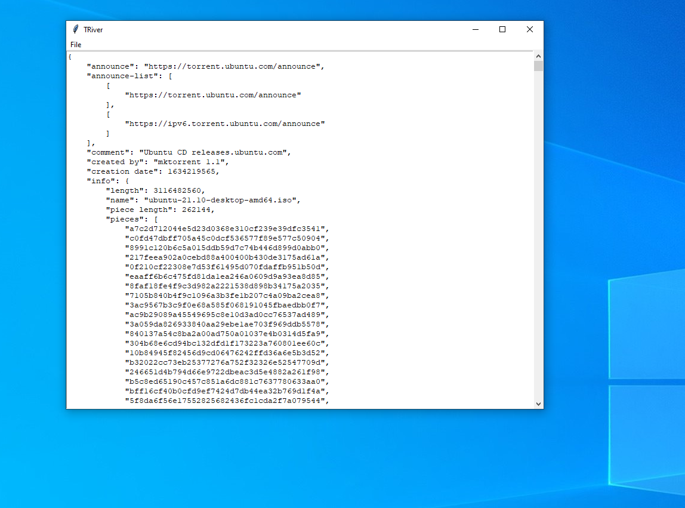

# TRiver

### Description

A Torrent Editor for Linux ,Windows Mac

### License
GPLv3 - [read here](https://github.com/Frankmau5/TRiver/blob/main/LICENSE)

### Install

#### For Linux Desktop

Download [Here](https://github.com/Frankmau5/TRiver/releases/download/v1.0.1/TRiver) the TRiver file and place it where you want but you might want to add it to your PATH

#### For Windows

Download [HERE](https://github.com/Frankmau5/TRiver/releases/download/v1.0.1/main.exe) the exe file and then double click on the exe

#### For Mac

clone project and go to the src folder.
run the requirements.txt file with pip

`pip install -r requirements.txt`

then just double click on the main.py or run 

`python main.py`

In a Terminal

